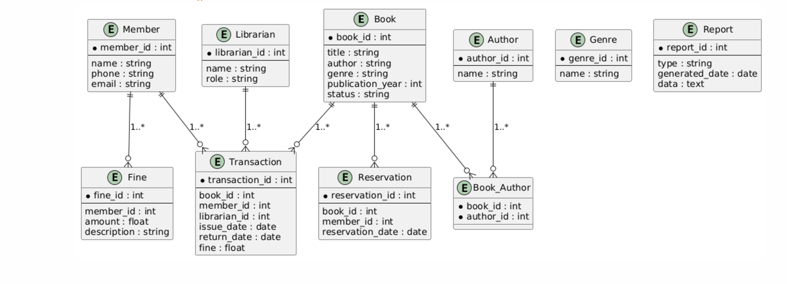
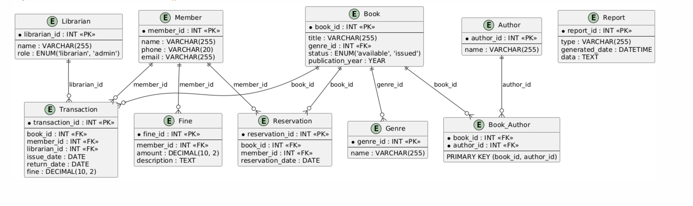

# Отчет по реализации базы данных

## 1. Введение

В рамках данной работы была разработана и реализована база данных для управления библиотекой. На основе анализа предметной области и описания бизнес-процессов была создана ER-диаграмма (/ER-diagram), которая включает не менее 10 сущностей и содержит хотя бы одно отношение "многие-ко-многим".


На основе ER-диаграммы была построена даталогическая модель (/DL-diagram), которая впоследствии была реализована в реляционной СУБД PostgreSQL.


---

## 2. Реализация логической модели

Логическая модель включает следующие таблицы:
- `Book` — книги;
- `Member` — члены библиотеки;
- `Librarian` — библиотекари;
- `Transaction` — транзакции (выдача/возврат книг);
- `Genre` — жанры книг;
- `Author` — авторы;
- `Book_Author` — связь книг и авторов (многие-ко-многим);
- `Reservation` — бронирования книг;
- `Fine` — штрафы;
- `Report` — отчеты.

Каждая таблица была спроектирована с учетом требований целостности данных: определены первичные ключи, внешние ключи, ограничения, а также создан ряд триггеров для автоматизации процессов.
```sql
-- Table: Book
CREATE TABLE Book (
    book_id SERIAL PRIMARY KEY,
    title VARCHAR(255) NOT NULL,
    genre_id INT REFERENCES Genre(genre_id),
    status ENUM('available', 'issued'),
    publication_year YEAR
);

-- Table: Member
CREATE TABLE Member (
    member_id SERIAL PRIMARY KEY,
    name VARCHAR(255) NOT NULL,
    phone VARCHAR(20),
    email VARCHAR(255) UNIQUE
);

-- Table: Librarian
CREATE TABLE Librarian (
    librarian_id SERIAL PRIMARY KEY,
    name VARCHAR(255) NOT NULL,
    role ENUM('librarian', 'admin')
);

-- Table: Transaction
CREATE TABLE Transaction (
    transaction_id SERIAL PRIMARY KEY,
    book_id INT REFERENCES Book(book_id),
    member_id INT REFERENCES Member(member_id),
    librarian_id INT REFERENCES Librarian(librarian_id),
    issue_date DATE NOT NULL,
    return_date DATE,
    fine DECIMAL(10, 2) DEFAULT 0
);

-- Table: Genre
CREATE TABLE Genre (
    genre_id SERIAL PRIMARY KEY,
    name VARCHAR(255) NOT NULL
);

-- Table: Author
CREATE TABLE Author (
    author_id SERIAL PRIMARY KEY,
    name VARCHAR(255) NOT NULL
);

-- Table: Book_Author (Many-to-Many)
CREATE TABLE Book_Author (
    book_id INT REFERENCES Book(book_id) ON DELETE CASCADE,
    author_id INT REFERENCES Author(author_id) ON DELETE CASCADE,
    PRIMARY KEY (book_id, author_id)
);

-- Table: Reservation
CREATE TABLE Reservation (
    reservation_id SERIAL PRIMARY KEY,
    book_id INT REFERENCES Book(book_id),
    member_id INT REFERENCES Member(member_id),
    reservation_date DATE NOT NULL
);

-- Table: Fine
CREATE TABLE Fine (
    fine_id SERIAL PRIMARY KEY,
    member_id INT REFERENCES Member(member_id),
    amount DECIMAL(10, 2) NOT NULL CHECK (amount >= 0),
    description TEXT
);

-- Table: Report
CREATE TABLE Report (
    report_id SERIAL PRIMARY KEY,
    type VARCHAR(255) NOT NULL,
    generated_date TIMESTAMP DEFAULT CURRENT_TIMESTAMP,
    data TEXT
);
```
---

## 3. Обеспечение целостности данных

Для обеспечения целостности данных реализованы следующие триггеры:
1. **Обновление статуса книги при выдаче** — триггер `trigger_update_book_status_on_issue` обновляет статус книги на `issued`.
```sql
CREATE OR REPLACE FUNCTION update_book_status_on_issue()
RETURNS TRIGGER AS $$
BEGIN
    UPDATE Book SET status = 'issued' WHERE book_id = NEW.book_id;
    RETURN NEW;
END;
$$ LANGUAGE plpgsql;

CREATE TRIGGER trigger_update_book_status_on_issue
AFTER INSERT ON Transaction
FOR EACH ROW
EXECUTE FUNCTION update_book_status_on_issue();
```
2. **Обновление статуса книги при возврате** — триггер `trigger_update_book_status_on_return` возвращает статус книги на `available`.
```sql
CREATE OR REPLACE FUNCTION update_book_status_on_return()
RETURNS TRIGGER AS $$
BEGIN
    UPDATE Book SET status = 'available' WHERE book_id = NEW.book_id;
    RETURN NEW;
END;
$$ LANGUAGE plpgsql;

CREATE TRIGGER trigger_update_book_status_on_return
AFTER UPDATE ON Transaction
FOR EACH ROW
WHEN (NEW.return_date IS NOT NULL AND OLD.return_date IS NULL)
EXECUTE FUNCTION update_book_status_on_return();
```
3. **Удаление бронирования при выдаче книги** — триггер `trigger_delete_reservation_on_issue` удаляет запись о бронировании, если книга была выдана.
```sql
CREATE OR REPLACE FUNCTION delete_reservation_on_issue()
RETURNS TRIGGER AS $$
BEGIN
    DELETE FROM Reservation WHERE book_id = NEW.book_id AND member_id = NEW.member_id;
    RETURN NEW;
END;
$$ LANGUAGE plpgsql;

CREATE TRIGGER trigger_delete_reservation_on_issue
AFTER INSERT ON Transaction
FOR EACH ROW
EXECUTE FUNCTION delete_reservation_on_issue();

```
6. **Проверка доступности книги** — триггер `trigger_check_book_availability` запрещает выдачу книги, если она уже выдана.
```sql
CREATE OR REPLACE FUNCTION check_book_availability()
RETURNS TRIGGER AS $$
BEGIN
    IF (SELECT status FROM Book WHERE book_id = NEW.book_id) = 'issued' THEN
        RAISE EXCEPTION 'Book is already issued.';
    END IF;
    RETURN NEW;
END;
$$ LANGUAGE plpgsql;

CREATE TRIGGER trigger_check_book_availability
BEFORE INSERT ON Transaction
FOR EACH ROW
EXECUTE FUNCTION check_book_availability();
```
---

## 4. Скрипты для управления базой данных

### Создание базы данных
Для создания базы данных был реализован скрипт, включающий определение всех таблиц и ограничений.
```sql
CREATE DATABASE library_management;

\c library_management

-- Здесь добавляются все таблицы, перечисленные ранее
```
### Удаление базы данных
Предоставлен скрипт для полного удаления базы данных.
```
DROP DATABASE IF EXISTS library_management;
```
### Заполнение тестовыми данными
Скрипт заполнения включает тестовые данные для всех таблиц:
- Жанры;
- Авторы;
- Книги;
- Члены библиотеки;
- Библиотекари;
- Транзакции;
- Бронирования.
```
-- Жанры
INSERT INTO Genre (name) VALUES ('Fiction'), ('Non-Fiction'), ('Science'), ('History');

-- Авторы
INSERT INTO Author (name) VALUES ('Author One'), ('Author Two'), ('Author Three');

-- Книги
INSERT INTO Book (title, genre_id, status, publication_year)
VALUES
('Book One', 1, 'available', 2020),
('Book Two', 2, 'available', 2018),
('Book Three', 3, 'available', 2021);

-- Связь книги и автора
INSERT INTO Book_Author (book_id, author_id)
VALUES
(1, 1), (2, 2), (3, 3);

-- Члены библиотеки
INSERT INTO Member (name, phone, email)
VALUES
('Member One', '123-456-7890', 'member1@example.com'),
('Member Two', '098-765-4321', 'member2@example.com');

-- Библиотекари
INSERT INTO Librarian (name, role)
VALUES
('Librarian One', 'librarian'),
('Admin One', 'admin');

-- Транзакции
INSERT INTO Transaction (book_id, member_id, librarian_id, issue_date, return_date, fine)
VALUES
(1, 1, 1, '2023-11-01', NULL, 0);

-- Бронирование
INSERT INTO Reservation (book_id, member_id, reservation_date)
VALUES
(2, 2, '2023-12-01');

```

---

## 5. Функции и процедуры

Для выполнения ключевых операций в системе были разработаны следующие PL/pgSQL-функции:
1. **Выдача книги** (`issue_book`) — проверяет доступность книги, создает запись о выдаче и обновляет статус книги.
```sql
CREATE OR REPLACE FUNCTION issue_book(p_book_id INT, p_member_id INT, p_librarian_id INT)
RETURNS VOID AS $$
BEGIN
    -- Ensure book is available
    IF (SELECT status FROM Book WHERE book_id = p_book_id) = 'issued' THEN
        RAISE EXCEPTION 'Book is already issued.';
    END IF;

    -- Issue the book
    INSERT INTO Transaction (book_id, member_id, librarian_id, issue_date)
    VALUES (p_book_id, p_member_id, p_librarian_id, CURRENT_DATE);

    UPDATE Book SET status = 'issued' WHERE book_id = p_book_id;
END;
$$ LANGUAGE plpgsql;

```
2. **Возврат книги** (`return_book`) — обновляет дату возврата и статус книги, а также фиксирует штраф (если есть).
```sql
CREATE OR REPLACE FUNCTION return_book(p_transaction_id INT, p_fine DECIMAL DEFAULT 0)
RETURNS VOID AS $$
BEGIN
    UPDATE Transaction SET return_date = CURRENT_DATE, fine = p_fine WHERE transaction_id = p_transaction_id;

    UPDATE Book SET status = 'available'
    WHERE book_id = (SELECT book_id FROM Transaction WHERE transaction_id = p_transaction_id);
END;
$$ LANGUAGE plpgsql;
```
3. **Генерация отчета по задолженностям** (`generate_overdue_report`) — формирует JSON-отчет о книгах, которые не были возвращены в срок.
```sql
CREATE OR REPLACE PROCEDURE generate_overdue_report()
LANGUAGE plpgsql AS $$
BEGIN
    INSERT INTO Report (type, data)
    SELECT 'Overdue Books', json_agg(row_to_json(t))
    FROM (
        SELECT m.name AS member_name, b.title AS book_title, t.issue_date, t.return_date
        FROM Transaction t
        JOIN Member m ON t.member_id = m.member_id
        JOIN Book b ON t.book_id = b.book_id
        WHERE t.return_date IS NULL AND t.issue_date < CURRENT_DATE - INTERVAL '30 days'
    ) t;
END;
$$;
```
4. **Поиск книг** (`search_books`) — позволяет искать книги по названию или имени автора.
```sql
CREATE OR REPLACE FUNCTION search_books(p_keyword VARCHAR)
RETURNS TABLE (book_id INT, title VARCHAR, author_name VARCHAR, status VARCHAR) AS $$
BEGIN
    RETURN QUERY
    SELECT b.book_id, b.title, a.name, b.status
    FROM Book b
    JOIN Book_Author ba ON b.book_id = ba.book_id
    JOIN Author a ON ba.author_id = a.author_id
    WHERE b.title ILIKE '%' || p_keyword || '%'
       OR a.name ILIKE '%' || p_keyword || '%';
END;
$$ LANGUAGE plpgsql;
```

---

## 6. Создание индексов

Для оптимизации производительности запросов были добавлены индексы:
1. **Индексы для таблицы `Book`:**
   - `idx_book_title` — для ускорения поиска книг по названию.
   - `idx_book_status` — для фильтрации книг по статусу.


2. **Индексы для таблицы `Member`:**
   - `idx_member_name` — для быстрого поиска членов по имени.

```
-- Optimize Book Search
CREATE INDEX idx_book_title ON Book(title);
CREATE INDEX idx_book_status ON Book(status);


-- Optimize Member Search
CREATE INDEX idx_member_name ON Member(name);
```
---

## 7. Заключение

Разработанная база данных полностью соответствует требованиям:
- Содержит не менее 10 сущностей.
- Реализовано отношение "многие-ко-многим" через таблицу `Book_Author`.
- Обеспечена целостность данных с помощью ограничений, триггеров и индексов.
- Созданы функции и процедуры для выполнения критически важных операций.

Данная база данных готова к дальнейшему использованию и масштабированию.
